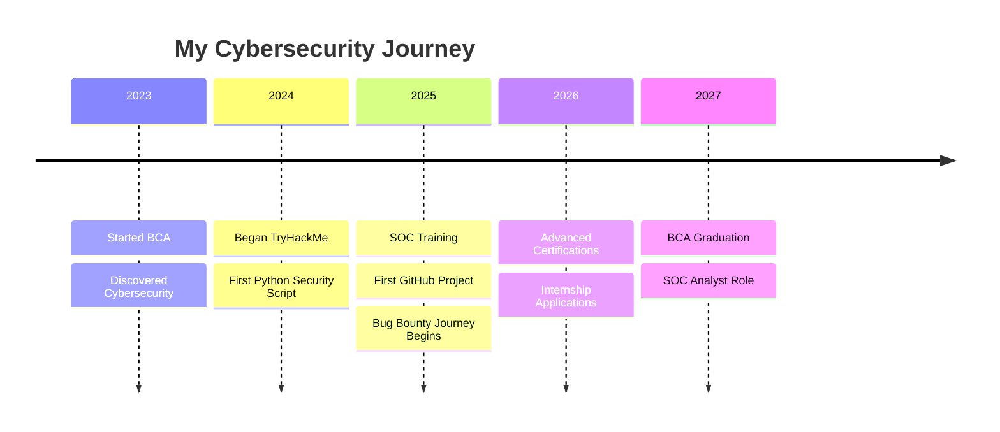

<div align="center">

# 👋 Hey, I'm Hunter (TheCreator)


<br>

[](https://github.com/GAHLOTAA13)

[](https://tryhackme.com/p/TheCreator13)

</div>

---

## 🚀 About Me

```python
class Hunter:
    def __init__(self):
        self.username = "TheCreator"
        self.location = "Sri Ganganagar, Rajasthan, India 🇮🇳"
        self.education = {
            "degree": "Bachelor of Computer Applications (BCA)",
            "year": "2nd Year",
            "university": "Maharaja Ganga Singh University, Bikaner",
            "graduation": 2027
        }
        self.current_focus = [
            "SOC Level 1 Training",
            "Bug Bounty Hunting", 
            "Malware Analysis",
            "Threat Hunting",
            "Building Security Tools"
        ]
        self.career_goal = "SOC Analyst → Senior Security Analyst"
        self.mission = "Mentor students from my region who lack cybersecurity guidance"
    
    def say_hi(self):
        print("Thanks for stopping by! Let's build secure systems together 🔐")

me = Hunter()
me.say_hi()
```

---

## 💡 My Story

> 🎯 **From a small town in Rajasthan to the global cybersecurity arena**

I'm a **2nd-year BCA student** passionate about **defending digital infrastructure** and **hunting vulnerabilities**. Growing up in Sri Ganganagar, I realized cybersecurity guidance was scarce in smaller cities. That's why I'm building in public, documenting my journey, and planning to **mentor future security professionals** from my region.

**What drives me:**
- 🔍 Curiosity to understand how systems break
- 🛡️ Passion to defend and protect
- 🤝 Commitment to give back to my community
- 💪 Proof that geography doesn't limit potential

---

## 🎯 Current Mission

<table>
<tr>
<td width="50%">

### 🔥 Active Training
- 📚 **TryHackMe** - SOC Level 1 Path
- 🐛 **Bug Bounty** - Practical recon & enumeration
- 🧪 **Labs** - Malware analysis, incident response
- 🏆 **CTFs** - Sharpening problem-solving skills

</td>
<td width="50%">

### 🎓 Next Milestones
- [ ] Complete SOC Level 1 certification
- [ ] First valid bug bounty submission
- [ ] eJPT certification (2025)
- [ ] BTL1 - Blue Team Level 1
- [ ] Launch mentorship program

</td>
</tr>
</table>

---

## 🛠️ Tech Stack & Tools

### 💻 Languages


### 🔐 Security Tools

<div align="center">

| Reconnaissance | Vulnerability Analysis | Network Analysis | Web Security |
|:--------------:|:----------------------:|:----------------:|:------------:|
| Nmap | Burp Suite | Wireshark | OWASP ZAP |
| ffuf | Metasploit | tcpdump | SQLMap |
| Gobuster | Nessus | Zeek | Nikto |
| Amass | OpenVAS | NetworkMiner | WPScan |

</div>

### 🐧 Operating Systems


### 📊 SIEM & Analysis


---

## 📈 GitHub Statistics

<div align="center">


</div>

<div align="center">


</div>

---

## 🏆 Projects & Contributions

### 🔧 Featured Projects

<table>
<tr>
<td width="50%">

#### 🎯 [URL Endpoint Fuzzer](https://github.com/GAHLOTAA13/url-endpoint-fuzzer)
Python tool for bug bounty reconnaissance
- 49+ security endpoints
- Cross-platform support
- Zero dependencies


</td>
<td width="50%">

#### 🛡️ [Coming Soon: SOC Toolkit]
Collection of SOC analyst automation scripts
- Log analysis automation
- Threat intelligence aggregator
- Incident response playbooks


</td>
</tr>
</table>

### 📊 Contribution Activity

```
2024-2025 Learning Journey
██████░░░░ 60% SOC Level 1 Training
███████░░░ 70% TryHackMe Pre-Security Path
████░░░░░░ 40% Bug Bounty Practical Skills
██░░░░░░░░ 20% Malware Analysis
███░░░░░░░ 30% Tool Development
```

---

## 🎓 Certifications & Learning Path

### ✅ Completed
- 🟢 **TryHackMe** - Pre-Security Path
- 🟢 **Coursera** - Google Cybersecurity Certificate (Applied)
- 🟢 **PortSwigger** - Web Security Academy (In Progress)

### 🎯 Pursuing (2025-2026)
- 🔵 **eJPT** - eLearnSecurity Junior Penetration Tester
- 🔵 **BTL1** - Blue Team Level 1
- 🔵 **Security+** - CompTIA
- 🔵 **CEH** - Certified Ethical Hacker (Future)

### 🚀 Long-term Goals (2027+)
- 🔴 **OSCP** - Offensive Security Certified Professional
- 🔴 **GCIH** - GIAC Certified Incident Handler
- 🔴 **CISSP** - Certified Information Systems Security Professional

---

## 📚 Learning Resources I Recommend

<details>
<summary>🔓 Click to view my favorite learning platforms</summary>

### 🎮 Hands-On Labs
- **TryHackMe** - Best for beginners, structured paths
- **HackTheBox** - Advanced challenges
- **Blue Team Labs Online** - SOC analyst training
- **CyberDefenders** - Real-world blue team scenarios

### 📖 Books I'm Reading
- "The Hacker Playbook 3" - Peter Kim
- "Blue Team Handbook" - Don Murdoch
- "Practical Malware Analysis" - Michael Sikorski
- "The Art of Invisibility" - Kevin Mitnick

### 🎥 YouTube Channels
- NetworkChuck
- John Hammond
- IppSec
- LiveOverflow
- The Cyber Mentor

### 📝 Blogs & Resources
- SANS Reading Room
- Krebs on Security
- Bleeping Computer
- r/netsec, r/AskNetsec

</details>

---

## 💼 What I'm Looking For

```yaml
opportunities:
  internships:
    - SOC Analyst Intern
    - Cybersecurity Analyst Intern
    - Bug Bounty Researcher Intern
  
  collaboration:
    - Open source security tools
    - CTF teams
    - Research projects
    - Community mentorship programs
  
  learning:
    - Advanced malware analysis
    - Cloud security (AWS, Azure)
    - Threat hunting techniques
    - Incident response procedures

availability:
  full_time_from: "2027 (Post-graduation)"
  part_time: "Open to remote internships"
  projects: "Always open to collaborate"
```

---

## 🌟 Recent Activity

<!--START_SECTION:activity-->
<!--END_SECTION:activity-->

---

## 📫 Connect With Me

<div align="center">

[](https://www.linkedin.com/in/mukesh-gahlot-5713b5242)
[](https://www.instagram.com/gahlot_aa13?igsh=ODE4ZnJmcXh3a3Vq)
[](https://tryhackme.com/p/TheCreator13)
[](https://hackerone.com/TheCreator_1322)

### 💬 Let's Talk About
🔐 Security Operations • 🐛 Bug Bounty • 🎓 Career Guidance • 🤝 Open Source Collaboration

</div>

---

## 🎯 2025 Goals Tracker

- [x] Launch first security tool (URL Endpoint Fuzzer)
- [x] Start GitHub profile & build in public
- [ ] Complete SOC Level 1 certification
- [ ] Submit first valid bug bounty report
- [ ] Reach 100 GitHub stars across projects
- [ ] Write 5 cybersecurity blog posts
- [ ] Contribute to 3 open source security projects
- [ ] Build local cybersecurity community in Rajasthan

---

## 💭 Favorite Quote

> *"The best defense is a good offense, but the best security professional knows both."*

---

## 📊 Weekly Development Breakdown

<!--START_SECTION:waka-->
<!--END_SECTION:waka-->

---

## 🏅 Achievements & Badges

<div align="center">


</div>

---

## 🎮 Hobbies & Interests

When I'm not hunting bugs or analyzing malware:

- 🎯 **CTF Competitions** - Weekend warrior
- 📝 **Technical Writing** - Documenting my journey
- 🎓 **Mentoring** - Helping juniors get started
- 🏃 **Fitness** - Healthy mind, healthy code
- 📚 **Reading** - Tech & security books

---

## 🌍 Community Contributions

```
📊 Statistics:
├── 🛠️  Open Source Projects: 1 (Growing)
├── 📝 Blog Posts Written: Coming Soon
├── 🎤 Tech Talks Given: 0 (First one in 2025!)
├── 👥 Students Mentored: Starting Soon
└── 🌟 GitHub Stars Earned: Counting...
```

---

## 🚀 Journey Timeline



---

<div align="center">

### 🌟 Thanks for visiting! 


**💙 Building Secure Systems • 🛡️ One Line of Code at a Time**


</div>

---

<div align="center">
<sub>⭐ From <a href="https://github.com/GAHLOTAA13">GAHLOTAA13</a> with ❤️ | Made in Rajasthan 🇮🇳</sub>
</div>
